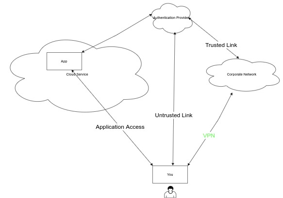

# vpnaddon

Third party authentication and authorisation providers like okta, azure, gcs or aws often have a trusted connection to the tennants. This sometimes allows that authentication requests via MFA/2FA options can be bypassed as the authentication has already occured from inside the tennants network.  
When employees work from remote locations they can set up a VPN to their companies network in one of two modes.

* Full Tunnel - this causes ALL traffic to travers the VPN to the companies network and then is propagated to their internal server or via firewalls and proxies to the internet.  

* Split Tunnel - Only traffic destined for the subnet routes that get pushed from the vpn server will traverse the vpn tunnel.

The full tunnel setup may be helpful if you only work with systems inside your corporate network. Given the fact vast amount of application are now published in some obscure place called "The Cloud" you basically have no clue where it resides.

## Diagram

The above diagram basically involves the following flow when you  work from a remote location and you want to acces an application that is linked to an authentication provider (AP from here on) :

1. You enter the URL of the application.
2. As you don't have an authentication token the application sends you to the "AP".
3. The AP gets your login credentials an verifies this with the access authority. This may be handled by itself of does a back-line check to the corporate network.
4. If the credentials check out the AP sends you a token which validates your authenticity and re-directs you back to the application which is aware of the authenticity of that token and as such gives you access.

In the vast majority these days the AP also has MFA/2FA (Multi Factor/2 Factor Authentication) enabled. This means that as soon as your credentials have been verified a second verification is done. This is most often via a phone app or SMS text message with a code you need to type in or a message you need to acknowledge. If that is succesful the AP wil then send you the same token and bob's your uncle.  
As long as the second verification is not succesfully completed the AP will not provide that token and henceforth you will not get access to the application.

## So why in the hell so I need this script

Ahh, good question. The problem is that these tokens have a finite lifetime which, depending on your companies policy, may be relatively short. That means that as soon as that token expires the application will again prompt you for your credential, back-ground check are done, MFA request is sent ....... (you get the drift) Bloody annoying.  

If your companies IT people have configured the option that MFA/2FA authentication requests may be bypassed if the request is received from over the "Trusted Link" it is benefical to have your request to the AP be routed over that VPN link, via the corporate network to the AP access point. That saves you from constantly having to pull your phone and muck around with these apps.

## What causes this token to expire

The lifetime of the token is often linked to a session between your browser and the webserver/cluster. These sessions have a session timeout which is configurable per application running on that webserver. So if that session timeout is set to 10 minutes and there is no activity from your browser to that server the session will expire and the token invalidated. You might argue that the session time can be set to 8 hours or so but your security folks would come after you with a chainsaw.  
Hacking methodologies like session hyjacking via cross-site scripting etc will incur a huge exposure if your application are set that way.

## So what does this script do

___It does not bypass any security mechanisms !!!___
When your VPN session is set up the same authentication methodology is followed as with the application itself. So a credentials check and MFA/2FA authentication is done anyway. The script runs as part of the VPN initialisation causing routes to the AP to also traverse the VPN tunnel, via your companies network to the AP over the trusted link therefore being able to bypass subsequent MFA requests.  
As soon as you disconnect the VPN all these routes are deleted and the normal pathways are followed again resulting in constant MFA requests.
